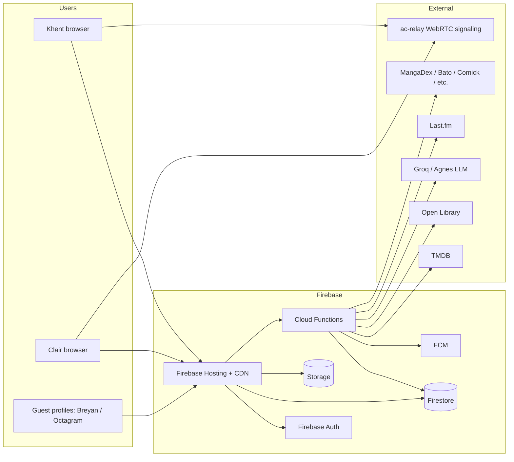
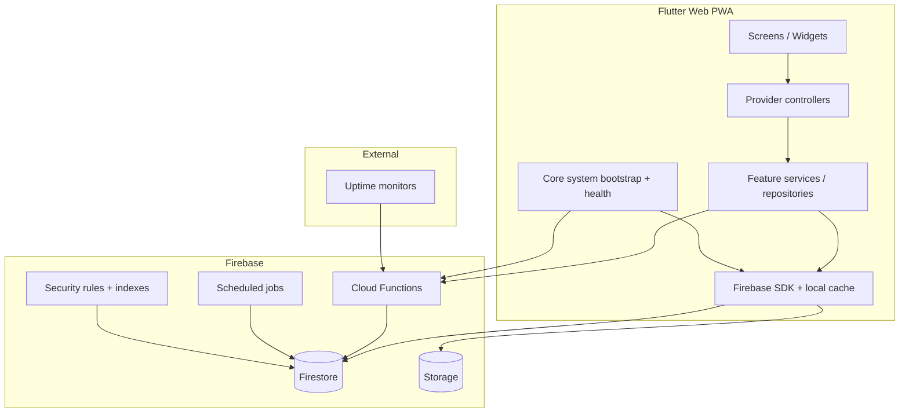
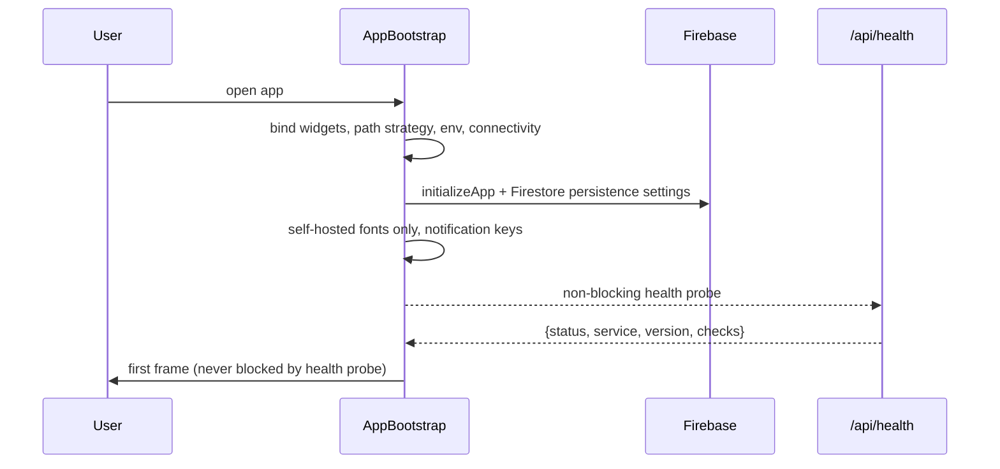
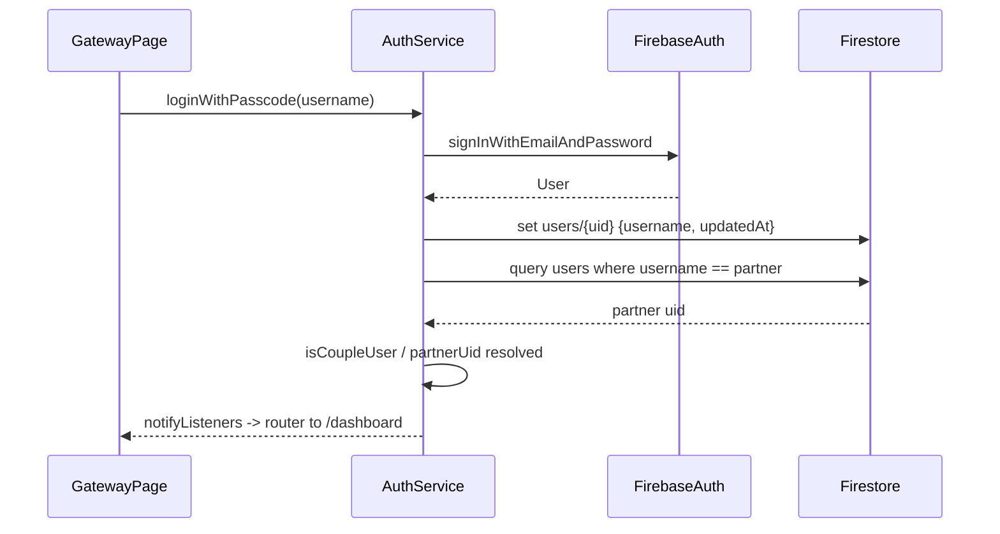
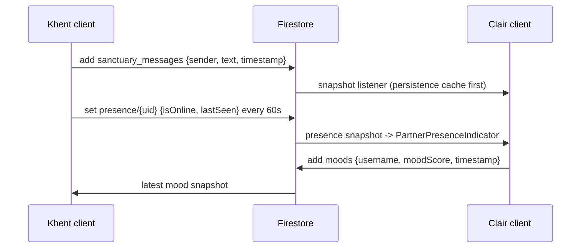
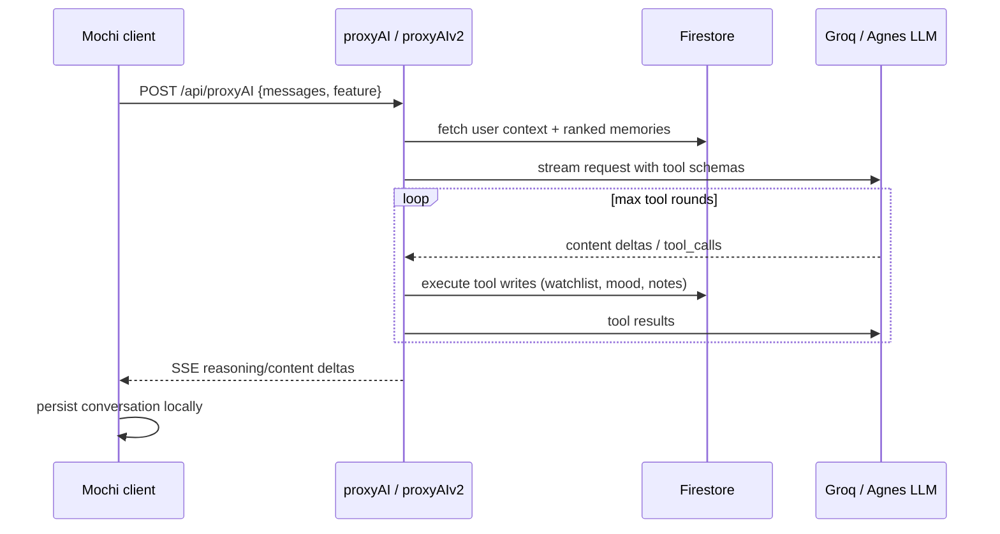
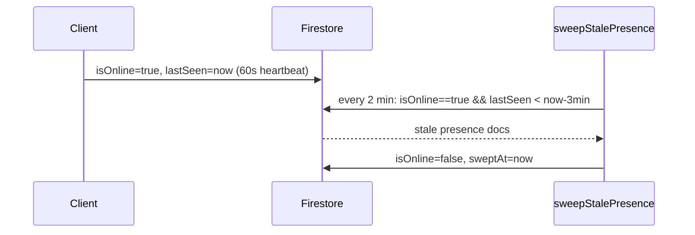

# Everglow System Architecture

> Private digital relationship scrapbook for Khent & Clair. Flutter Web + Firebase.
> This document is the system-level contract for how Everglow scales, where data
> lives, how it flows, and what the minimal production core must guarantee.

## 1. Goals And Constraints

### Goals

- Keep the couple's private experience (chat, moods, memories, watchlists) fast,
  offline-tolerant, and correct.
- Keep the entire stack small enough for two to five people while leaving a
  clean path to wider audiences: multi-couple tenancy, analytics, regional
  deployments.
- Make every state-changing write enforceable by Firestore security rules and
  every expensive or risky operation (proxies, LLM, push) server-side.
- Make startup deterministic, observable, and versioned.

### Constraints

- Frontend is Flutter Web deployed to Firebase Hosting; there is no native
  client in the current production path.
- Backend is serverless Firebase: Auth, Firestore, Storage, Functions, FCM.
- State management is Provider; routing is go_router; no Riverpod/Bloc.
- Secrets never ship in source; `assets/env.txt` is local-only and ignored by
  the design below.
- One shared Firestore database, no sharding in the current product stage.

## 2. System Context



The browser talks to Firestore/Storage directly through the Firebase SDK
(real-time reads, offline cache). Cloud Functions exist only where browser
direct access is unsafe, blocked by CORS, secret-bearing, or too heavy:
proxies, AI streaming, push fan-out, and scheduled maintenance.

## 3. Architecture Overview



### Layering rules

1. Screens never touch Firestore directly; they call a feature service or
   controller through Provider.
2. Feature services return domain models, not raw `DocumentSnapshot`.
3. Streams use `withFirestoreTimeout` so a wedged web listener degrades to a
   retry UI instead of an infinite spinner.
4. Writes are validated twice: client-side before dispatch and server-side by
   security rules (shape + ownership).
5. Anything that exposes an API key or needs CORS relief goes through Cloud
   Functions with an allow-list where a URL is involved.

## 4. Component Structure

```text
lib/
  main.dart                     # runZonedGuarded -> AppBootstrap -> EverglowApp
  core/
    system/                     # NEW minimal production core
      app_bootstrap.dart        # deterministic startup orchestrator
      app_version.dart          # version source of truth
      health_service.dart       # /api/health probe (offline-tolerant)
      system_status.dart        # typed health contract
    router/app_router.dart      # all GoRouter routes
    theme/                      # Dusk Petal design tokens
    utils/                      # logger, stream timeouts, connectivity
    services/                   # NotificationService (FCM)
    models/                     # shared models (PresenceStatus)
  services/                     # AuthService, PresenceService, StorageService
  features/<feature>/
    data/                       # models + services + repository impls
    domain/                     # domain models + repository interfaces
    presentation/               # screens, widgets, controllers, providers
  shared/widgets/everglow/      # design system

functions/
  index.js                      # HTTP functions, Firestore triggers, schedules
  mochi_core.js                 # pure AI helpers (testable)
  system_core.js                # pure presence TTL helpers (testable)

firestore.rules                 # single source of truth for access control
firestore.indexes.json          # explicit composite indexes
web/                            # PWA shell, service worker, icons
```

### Serverless function taxonomy

| Kind | Functions | Responsibility |
|------|-----------|----------------|
| HTTP proxy | `proxyBookText`, `proxyManga*`, `proxyComick`, `proxyAnimeImage`, `proxyGalleryImage`, `proxyScanlation`, `proxyFetchHtml`, `proxyEmbed`, `proxyVideoStream`, `proxyWatchStream` | CORS/hotlink bypass with host allow-lists |
| AI | `proxyAI`, `proxyAIv2`, `agnesImage` | SSE streaming, tool execution, image generation |
| Ops | `health` | public liveness + Firestore reachability |
| Trigger | `onNewChatMessage`, `onNewMood`, `onNewStarDrop`, `onNewWatchlistItem`, `onNewGalleryPhoto`, `onWatchPartyInvite`, `onNewMilestone` | FCM partner notifications |
| Schedule | `keepWarm`, `mochiDailyDigest`, `mochiNightRecap`, `mochiMoodCheckIn`, `mochiSpecialDayNudge`, `sweepStalePresence` | maintenance + proactive features |
| Debug/admin | `debugGallery`, `cleanupGallery` | operational tooling (admin-only where destructive) |

## 5. Data Flow

### 5.1 Session bootstrap



### 5.2 Passcode -> authenticated session



Passcodes map to fixed profile usernames; credentials come from `EnvConfig`
with local fallbacks. The user document is the root of access: security rules
grant sanctuary access to authenticated users with a `users/{uid}` document.

### 5.3 Realtime couple data (chat, presence, mood)



Writes are optimistic through Firestore's web persistence: the local cache
echoes the write immediately, and the server reconciliation happens in the
background.

### 5.4 AI streaming



The client never sees API keys and never receives raw tool state; the server
absorbs tool execution and streams only the final dialogue.

### 5.5 Presence TTL



This closes the "ghost online" gap left when a browser tab closes without
logging out.

## 6. API Design

### 6.1 Firestore as the primary API

Firestore is the system of record and the real-time API. Queries are bounded
and documented by collection:

| Collection | Read contract | Write contract |
|------------|---------------|----------------|
| `users/{uid}` | authenticated, own or couple-shared docs | self-write only via `_syncUserDoc` |
| `presence/{uid}` | authenticated | self-write heartbeat; sweeper owns offline flip |
| `moods` | authenticated, latest per user via `username + timestamp desc` | authenticated create; validated fields |
| `sanctuary_messages` | authenticated couple user | authenticated couple user |
| `watch_party_rooms/{roomId}` | host or partner | host/partner, fixed uid pair |
| `voice_rooms/{roomId}` | caller or callee | caller/callee, bounded SDP strings |
| `config/{docId}` | authenticated read | server/admin only |
| `users/{uid}/progress/{docId}` | owner only | owner only |

Every query the client makes must be covered by a single-field auto-index or an
explicit composite index in `firestore.indexes.json`. The current explicit
indexes cover `bucket_list`, `moods`, and `presence`; add a new entry whenever
`where` + `orderBy` meet.

### 6.2 Cloud Functions REST surface

Convention: `POST`/`GET` JSON, CORS preflight accepted, optional Firebase ID
token verified when present, allow-listed upstream hosts, bounded timeouts.

| Endpoint | Method | Request | Response |
|----------|--------|---------|----------|
| `/api/health` | GET | none | `{status, service, version, time, uptimeSeconds, checks}` |
| `/api/proxyAI` | POST | `{messages, feature}` | SSE stream of `{reasoning, content}` deltas |
| `/api/proxyBookText` | POST | `{urls: string[]}` | `{text, usedUrl, attempted}` |
| `/api/proxyMangaImage` | GET | `?url=` | proxied image bytes, `Cache-Control: max-age=600` |
| `/api/cleanupGallery` | POST | `{confirm: true}` | `{deleted}` (Khent only) |

Errors follow `{error: string}` with conventional status codes: `400` shape,
`401` token, `403` host/owner, `405` method, `502` upstream, `503` degraded.

### 6.3 Scheduled jobs

- `sweepStalePresence`: every 2 minutes, Firestore-indexed stale sweep.
- `keepWarm`: every 10 minutes, reduces AI cold starts.
- `mochiDailyDigest` / `mochiNightRecap` / `mochiMoodCheckIn` /
  `mochiSpecialDayNudge`: Asia/Manila timezone proactive features.

### 6.4 External provider contracts

| Provider | Use | Key handling |
|----------|-----|--------------|
| Groq / Agnes | AI chat + image gen | server-side env only |
| TMDB | cinema/anime metadata | client `EnvConfig` fallback today; server proxy when moving to wider tenancy |
| Open Library | book text | `proxyBookText` server fetch |
| MangaDex / Bato / Comick / Mangakakalot / Mangasee123 | manga catalog + images | allow-listed host proxies |
| Last.fm | music status | read-only public key |
| ac-relay | WebRTC signaling | standalone Node server, not deployed to Firebase |

## 7. Database Schema

All timestamps are Firestore server timestamps; IDs are client-created or
`add()` generated. The schema below is the MVP set plus the couple-only rooms
that already exist.

### `users/{uid}`

| Field | Type | Notes |
|-------|------|-------|
| `username` | string | profile key: `khentsgdz`, `clairjassen`, `breyan`, `octagram` |
| `updatedAt` | timestamp | server set on every login sync |

### `presence/{uid}`

| Field | Type | Notes |
|-------|------|-------|
| `isOnline` | bool | client heartbeat, sweeper flips false |
| `isDoodling` | bool | canvas activity flag |
| `lastSeen` | timestamp | TTL input |
| `lastDoodleAt` | timestamp | idle window input |
| `username` | string | display |
| `updatedAt`, `sweptAt` | timestamp | last write / sweeper write |

Index: `isOnline ASC, lastSeen ASC` (sweeper query).

### `moods/{moodId}`

| Field | Type | Notes |
|-------|------|-------|
| `username` | string | partner lookup key |
| `uid` | string | optional auth uid for resilient partner resolution |
| `moodScore` | int | 1-5 |
| `moodEmoji` | string | display emoji |
| `timestamp` | timestamp | date-scoped |
| `date` | string `YYYY-MM-DD` | scheduled digest grouping |

Index: `username ASC, timestamp DESC` (latest mood query).

### `sanctuary_messages/{messageId}`

| Field | Type | Notes |
|-------|------|-------|
| `sender` | string | username |
| `senderUid` | string | auth uid |
| `text` | string | bounded by client validation |
| `timestamp` | timestamp | ordering key |

### Couple rooms

`watch_party_rooms/{roomId}` (host/partner uid pair fixed), 
`watch_party_chats/{roomId}/messages/*`,
`voice_rooms/{roomId}` (caller/callee, bounded SDP), and
`temporary_chats/{roomId}` all carry the couple's uid pair and are never
reassignable. Document IDs are deterministic sorted-uid joins so both members
agree without coordination.

### Shared scrapbook collections

`starlight_jar`, `our_cinema`, `watch_list`, `milestones`, `gallery`,
`calendar_events`, `bucket_list`, `garden_stats`, `canvas_strokes`,
`live_canvas`, `ai_memories`, `notes`, `read_list`, `manga_library`,
`academy_questions`, `active_matches`, `music_status`, `garden_stats`,
`guardian_messages`, `date_ideas`, `progress` — authenticated access with
per-owner rules where subcollections exist.

## 8. Caching Strategy

### Layer 1: Firebase Hosting CDN

`web/` static assets are immutable once built and served with
`Cache-Control: public, max-age=31536000, immutable` for hashed files
(`*.js`, `*.css`, fonts, icons). `index.html`, `sw.js`, `flutter.js`, and
`version.json` are explicitly `no-cache` so new builds take effect immediately.

### Layer 2: Firestore offline persistence

Enabled globally with a 100 MB cap:

- Chat, presence, mood, and watchlist reads replay from the local cache before
  the network confirms, so the app works on flaky connections.
- Writes are queued offline and reconciled by Firestore.
- `withFirestoreTimeout` prevents a hung listener from freezing the UI.

### Layer 3: Local device state

`SharedPreferences` caches the current profile (`current_user_name`) and FCM
token metadata. This is the only cross-restart session state; everything else
is derived from Firestore.

### Layer 4: Function response caching

| Surface | Policy |
|---------|--------|
| Manga/anime image proxies | `Cache-Control: public, max-age=600` |
| Gallery proxy | `max-age=3600` |
| Catalog proxies | `max-age=60` |
| Health | `no-store` |
| AI streams | never cached |

### Layer 5: In-process caches

- Mochi persona document cache with TTL.
- AI context cache (30s TTL) to avoid redundant Firestore reads on rapid
  messages.

### Invalidation rules

- Content that changes per user (presence, moods, chat) is never HTTP-cached.
- Build-versioned assets never need invalidation; `sw.js` regeneration stamps
  the build version.
- `sweptAt` timestamps let ops verify presence TTL without guessing.

## 9. Security Model

1. **Auth boundary**: anonymous fallback is allowed, but couple features check
   for a `users/{uid}` document.
2. **Ownership**: `users/{uid}/*` and `presence/{uid}` are self-scoped.
3. **Couple pair**: rooms/chat are read-write only for the two uids encoded in
   the document; uid pairs are immutable after creation.
4. **Shape validation**: room state enums and bounded SDP strings are enforced
   in rules to prevent payload abuse.
5. **Server-only secrets**: LLM keys, FCM keys, and proxy secrets live in
   Functions environment/config, never in web assets.
6. **URL allow-lists**: every proxy validates protocol `https:` and host
   suffix before fetching.
7. **Destructive ops**: `cleanupGallery` requires an ID token and the Khent
   profile.

## 10. Scaling And Reliability

### Current stage (2-5 users)

- Single Firebase project, one Firestore database, single region.
- Rules and indexes are source-controlled; deploys are atomic through CI.
- Presence TTL is enforced server-side, removing the most common stale-state
  bug.

### Multi-couple path

- Add `coupleId` to `users` and namespace shared collections by
  `couples/{coupleId}/{feature}/{docId}`.
- Move every security rule from "any authenticated user" to
  `coupleId in get(/users/{uid}).data.coupleIds`.
- Replace username-based partner lookup with a `users` query on `coupleId`.
- Keep `sanctuary_messages` partitioned by `coupleId` to avoid one hot chat
  collection.

### Load path

- Keep heavy reads (watchlists, catalog) in Firestore/Storage; push AI and
  proxying to Functions/Cloud Run.
- Add Firestore query limits and pagination before any screen can exceed a few
  thousand documents.
- When read amplification outgrows Firestore, introduce a read-model cache
  (e.g. Redis/Memorystore or a derived `digests` collection) written by
  scheduled functions.

### Reliability guarantees

- Startup never blocks on health, notifications, or remote fonts.
- Every Firestore stream has a timeout and a retry surface.
- Scheduled maintenance (`sweepStalePresence`) is idempotent: flipping an
  already-false document is a no-op.
- Known Firestore web race conditions are filtered from the unhandled-error
  path so real failures stay visible.

## 11. Observability And Deployment

### Deploy pipeline

`push main -> CI -> flutter analyze -> build web release -> generate sw.js ->
deploy Hosting -> install functions -> deploy functions + rules + storage ->
verify site 200`.

### Health monitoring

- Public `GET /api/health` returns service identity, version, uptime, and a
  Firestore reachability check.
- Clients probe once at startup (non-blocking) and record
  `backend=ok|degraded|unreachable` in the boot log.
- Uptime monitors should alert on non-200 or `status != ok` for two
  consecutive checks.

### Error visibility roadmap

Current release builds suppress unhandled errors by design; the immediate
follow-up is wiring `Logger` error sinks to a production reporter (Sentry for
Flutter Web, or a `error_reports` Firestore collection) and uploading source
maps in CI.

### Rollback

Hosting: redeploy the previous tagged `build/web` to the live channel.
Functions: `firebase deploy --only functions` from the previous tag. Rules:
revert `firestore.rules`/`firestore.indexes.json` and redeploy
`--only firestore`.

## 12. Minimal Production Version

The full product features already exist, so the minimal production version is
the *core foundation every feature depends on*, implemented now:

1. **Deterministic bootstrap** — `AppBootstrap` owns env load, Firebase init,
   Firestore persistence settings, fonts, notification wiring, and the health
   probe in a single testable sequence (`lib/core/system/app_bootstrap.dart`).
2. **Version source of truth** — `AppVersion` and the Functions `APP_VERSION`
   constant mirror `pubspec.yaml`; the app title and health endpoint report it.
3. **Health contract** — `GET /api/health` plus the offline-tolerant
   `HealthService` client and typed `SystemStatus`.
4. **Presence TTL** — `sweepStalePresence` scheduled job with pure, tested
   staleness logic (`functions/system_core.js`).
5. **Query schema** — explicit composite indexes for `moods` and `presence`
   sweeper queries.

### Verification

```text
flutter analyze
flutter test
cd functions && npm test
```

## 13. Runbook Cheat Sheet

| Task | Command |
|------|---------|
| Local app | `flutter run -d chrome` |
| Analyze | `flutter analyze` |
| Tests | `flutter test` |
| Functions tests | `cd functions && npm test` |
| Health check | `curl https://everglow-1c6db.web.app/api/health` |
| Deploy everything | `deploy.ps1` |
| Deploy rules only | `firebase deploy --only firestore:rules,firestore:indexes` |
