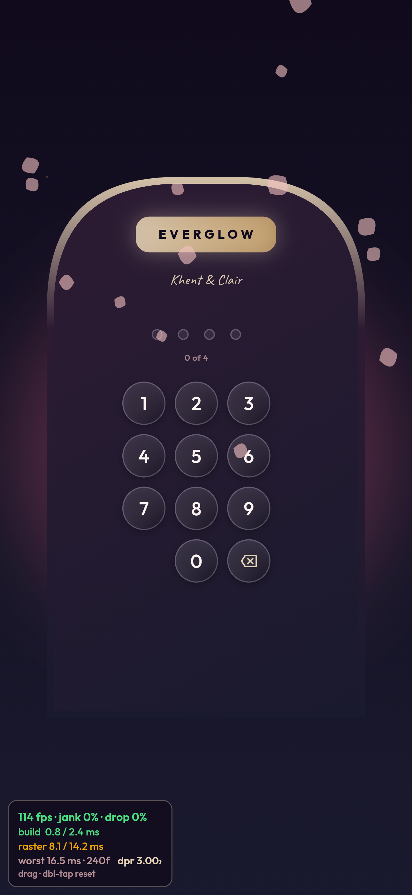

# Phone spot-check — how to judge this work

Everything automated in this pass can tell you the code got cheaper. It cannot
tell you whether Everglow is smooth on Clair's phone, because the headless rig
has a desktop GPU, no steady vsync, and no authenticated path into any feature
screen. **This page is how the goal's actual bar gets judged.** It takes about
ten minutes.

## The bar

| metric | pass |
| --- | --- |
| FPS (while scrolling a screen) | sustained **≥ 55** |
| jank | **< 5%** |
| dropped frames | **0** |
| worst single frame | **< 200ms** (a 200ms frame is a visible stutter) |
| first interactive, fast wifi | **< 2.5s** |

## Turn the meter on

Open the site in **Safari** and add `?perf=1` to the URL, e.g.

```
https://everglow-1c6db.web.app/dashboard?perf=1
```

A small dark panel appears in the bottom-left corner showing FPS, jank %, dropped
%, and build/raster average and worst. That is the frame meter; it was
unreachable before this pass (the code had been deleted while the docs still
told you to use it).

This is what you should see — captured at a 430x932 phone viewport, DPR 3,
with the meter live. If your panel does not look like this, `?perf=1` did not
take and the readings would be meaningless:



Reading that capture: **114 fps · jank 0% · drop 0%**, build 0.8/2.4 ms, raster
8.1/14.2 ms, worst 16.5 ms, 240 frames, dpr 3.00. Note the layout — average
then worst, per metric — so you can find each number at a glance.

Two things to know:

- **In the installed PWA the start URL cannot be edited**, so if you want the
  meter inside the PWA, turn it on from a normal Safari tab first — the setting
  is remembered. `?perf=0` turns it off again.
- You can also render at a lower pixel density with `?dpr=2`, which changes
  raster cost without changing layout. Only useful as a fallback check.

## How to take a reading

1. Scroll the screen to the **top**.
2. **Double-tap the meter** to reset its window (drag it somewhere out of the way
   if it covers the content).
3. Scroll that screen slowly, top to bottom, for about **10 seconds**. Then back
   up again for another 10.
4. Read the panel and write the numbers below.

Reset first, then scroll only the screen you care about — the meter measures
everything, so background activity pollutes it.

## What to fill in

One row per screen. `worst` is the build/raster "worst" figure in the panel.

| screen | FPS | jank % | dropped % | worst frame | verdict |
| --- | --- | --- | --- | --- | --- |
| Dashboard — scroll | | | | | |
| Cinema — browse grid | | | | | |
| Cinema — a shelf row | | | | | |
| Anime — browse / spotlight | | | | | |
| Manga — library grid | | | | | |
| Books — library grid | | | | | |
| Chat — scroll history | | | | | |
| Motchi — a reply streaming | | | | | |
| Any shelf while **idle** for 10s | | | | | |

The idle row matters as much as the scrolling ones: the ambience and tickers
keep painting when you are not touching anything, and that is time nobody
attributes to a stutter.

## Reading the numbers

- **FPS low, jank low** → the device is not the constraint; the app is simply
  capped or the panel is stale. Re-reset and re-read.
- **FPS high, build high** → widgets are re-running every frame. That is a
  rebuild loop, and it is the class this pass added
  `tool/ci/check_perf_rules.dart` to prevent.
- **FPS high, raster high** → too many pixels: full-screen gradients, shadows,
  blurs, glyphs. On a DPR-3 phone the surface is 1290x2796, so raster is the
  usual suspect.
- **A single very large `worst`** → a single stall. That is usually image decode
  or a Firestore round-trip landing mid-scroll; note which screen and whether it
  repeated on a second pass.
- **jank near 0 but FPS near 60 and nothing feels smooth** → trust the feel, and
  record it. The meter measures frames, not whether the interaction felt good.

## What was already measured, so you do not have to

| case | result |
| --- | --- |
| cold boot, slow 3G | first frame **138,580ms** — download-bound, ~13MB critical path |
| first paint, any network | **216ms** cold, **28ms** repeat (inline splash, no download needed) |
| worst main-thread task during boot | **0ms** across 9 runs — boot waits, never janks |

So cold boot is expected to be slow on a bad connection and that is not
something scrolling fixes. What *is* worth checking is first paint, which should
be instant, and the repeat visit, which is slower than it should be because the
service worker is network-first for the JS shell.

## If something does not pass

Report the screen, the four numbers, and whether it reproduced on a second pass.
The harness in `tool/perf/bench.mjs` and the notes in `docs/PERF_NOTES.md`
together with a single real device reading is enough to pin almost anything down —
several findings in this pass were only ever visible on a phone.