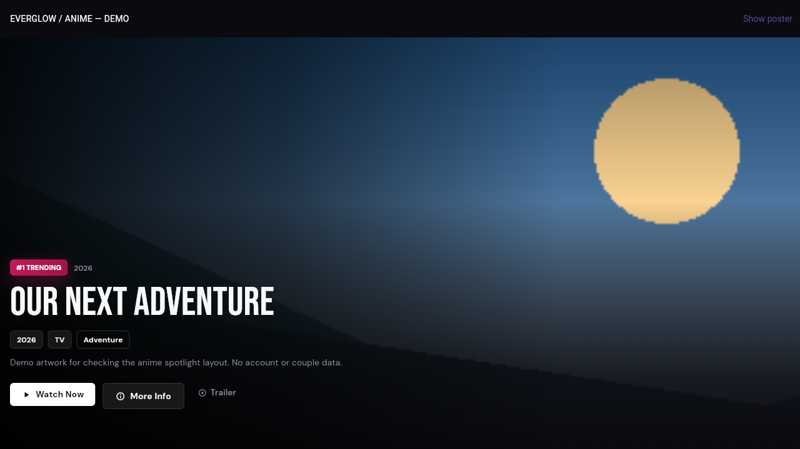
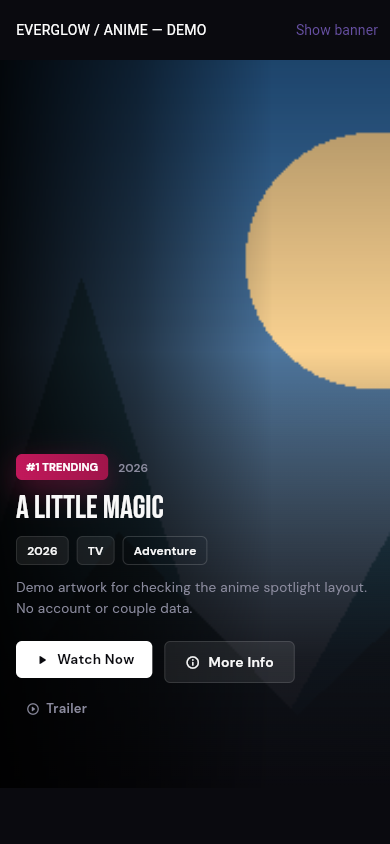
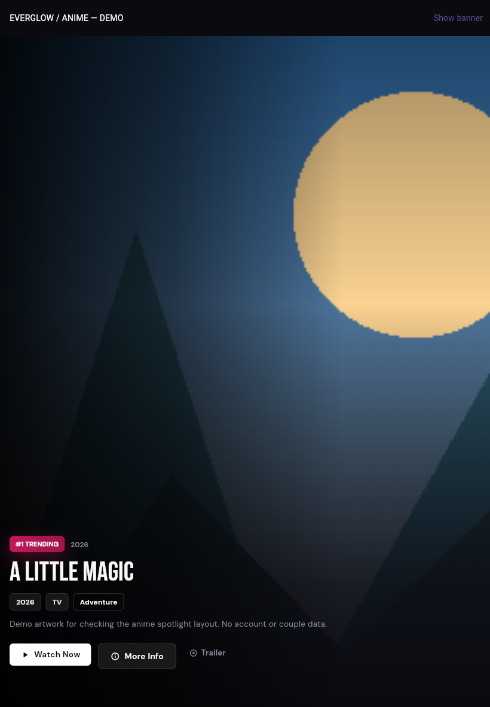

# Anime spotlight artwork sizing

The spotlight's default `AnimatedSwitcher` stack gave slide images loose
constraints. Loaded banners rendered as short centered strips, and poster
fallbacks rendered as small centered portraits. The transition now gives both
incoming and outgoing slides the full hero bounds, so `BoxFit.cover` can fill
the background.

## Verification

- Added a decoded-image regression using an 800 x 170 banner and a 232 x 330
  poster fallback. It failed before the fix on desktop, tablet, and phone.
- The same test now checks image coverage before switching, during the fade
  (both images present), and after switching at 1920 x 1080, 820 x 1180,
  and 390 x 844. All three cases pass.
- `flutter analyze`: no issues.
- `flutter test`: all 1,466 tests pass.
- All 14 `tool/ci/check_*.dart` regression guards pass.
- Launched the actual spotlight with `flutter run -d chrome` in a temporary
  demo harness, then inspected its standalone web build in the collaborative
  browser. Clicked Show poster and checked phone and tablet layouts.

The screenshots use generated demo scenery and fake titles, without account
or couple data. The demo header only provides an artwork toggle; the spotlight
is the production widget. The temporary harness and artwork source files were
removed after capture. Trailer playback and the authenticated live catalog
were not validated by this proof. This change does not modify trailer sizing.

