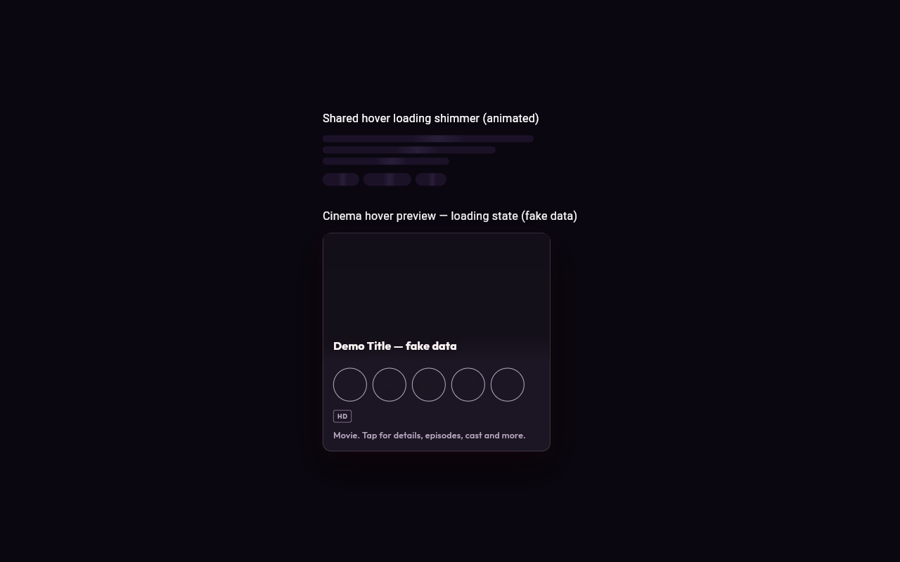
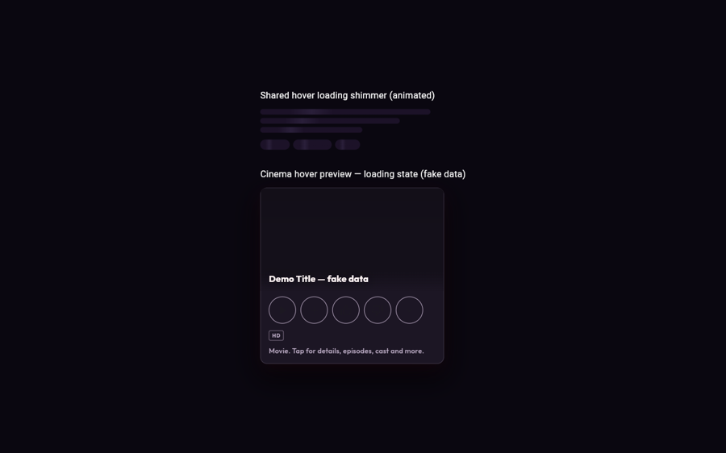

# Hover loading shimmer — proof

Fake demo data only. No real couple data.

## What changed

Anime + cinema hover cards used to show dead static grey bars (anime) or a
static fallback line (cinema) while details were still loading. Both now use
the shared animated shimmer:

- `lib/shared/widgets/everglow/everglow_skeleton.dart` — new
  `EverglowLoadingBars` + `EverglowLoadingChips` on the global shimmer ticker.
- `lib/features/anime/.../animex_poster_card.dart` — `_DetailBar` static bars
  replaced with the animated shared widgets (synopsis bars + genre chips).
- `lib/features/cinema/.../netflix_hover_preview.dart` — new `_loadingDetails`
  state shows animated shimmer for metadata + synopsis + genres while the TMDB
  fetch is in flight; the fallback copy only appears after the load resolves
  empty.

Whole-site check: anime + cinema are the only hover cards with async loading.
Books/manga/music/dashboard shelf cards have hover lift/glow but no loading
state, so nothing else needed the treatment.

## Proof

The loading window is transient (a few hundred ms on real networks, instant
in logged-out previews where the fetch fails fast), so static shots show the
shared shimmer widget mounted and the cinema preview in its post-load
fallback state. Animation is proven by:

1. Widget tests (deterministic, capture the loading window):
   - `test/shared/widgets/everglow/everglow_loading_bars_test.dart` — asserts
     the shared shimmer ticker is running (3 attached skeletons, controller
     repeating on its 1300ms cycle).
   - `test/features/cinema/netflix_hover_loading_test.dart` — asserts the
     cinema popover renders `EverglowLoadingBars` while `_details == null`
     and swaps to fallback copy after the fetch resolves.
2. Screen recording of the live preview (5s, shimmer sweeping):
   `C:\Users\Admin\.t3\userdata\attachments\dae94f5d-3acf-4c27-bda5-2d1b2bbfe437-ed879153-e505-4e42-9bb0-3f9ff711cb2a-mp4.mp4`
   (attach to the PR directly — too big for docs/).

## Checks run

- `flutter analyze` — clean.
- `flutter test test/features/cinema/ test/features/anime/animex_poster_card_test.dart test/shared/widgets/everglow/` — 261 passed.
- All `dart tool/ci/check_*.dart` guards — pass.
- Live Chrome preview of the shimmer widget + cinema preview (fake data).
