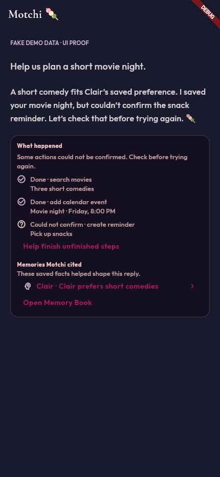
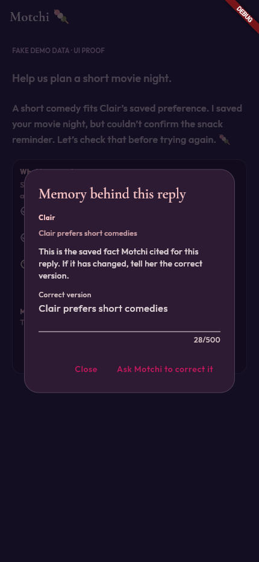
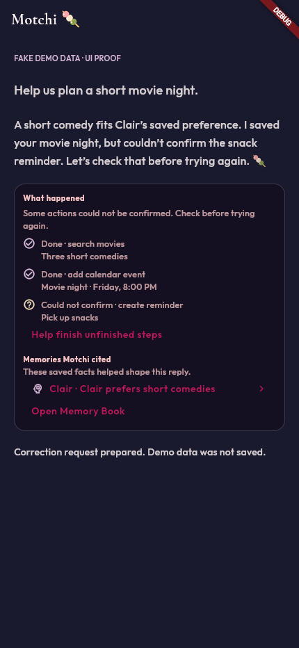
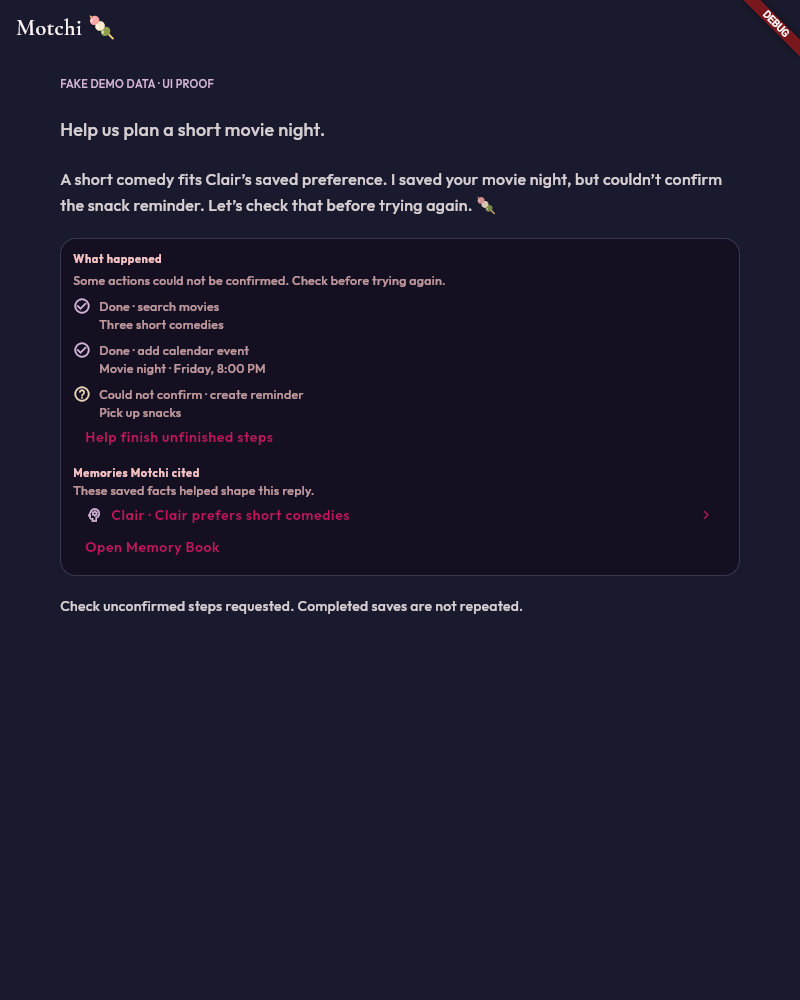

# Motchi: memory explanations and honest follow-through

All screenshots use invented demo preferences and plans. No real couple
records, credentials, or chat history were loaded.

## Chrome proof

Launched the changed card with the real Everglow theme via `flutter run
-d chrome` in a temporary, logged-out demo entry point (removed afterward).

- Phone: 430 × 932, verified receipts and the memory source card.
- Tapped the cited memory; the inspection/correction dialog opened.
- Changed its text and submitted a correction; the demo callback fired.
  This proves the UI interaction, not a live model/Firestore correction.
- Tapped “Help finish unfinished steps”; the demo callback fired.
- Tablet: 800 × 1000, verified the same card without layout errors.
- Browser errors and console were empty after these interactions.

## Runnable checks

- `flutter analyze`: no issues.
- `flutter test`: 1125 passed.
- `flutter build web --release`: passed.
- All 12 `dart tool/ci/check_*.dart` guards: passed.
- `npm --prefix functions test`: 274 passed; 1 emulator-only test skipped locally.
- Functions lint: passed with the existing 25 warnings (no new warnings).
- `npm --prefix functions audit --omit=dev --audit-level=moderate`: no vulnerabilities.
- `node functions/eval_gate.js`: passed (prompt v12).
- `dart tool/motchi_prompt_eval.dart`: 140/140.

The new HTTP-handler journey tests exercise both SSE and JSON paths with
fake auth/model responses and real calendar/reminder executors against
in-memory storage. They check the saved calendar record, unknown reminder
outcome, interrupted reply receipts, memory-tool citations, and no repeated
calendar write. Other tests cover citation validation, owner-preserving
memory correction, no automatic write retry, serialization, resolved
confirmations, and phone/tablet interactions.

Live authenticated model behavior, production Firestore writes, and an
actual network-loss/Stop interaction were not exercised in Chrome. The
screenshots are UI proof; deterministic tests cover receipt construction
and persistence, not a guarantee that the model always cites every fact.
