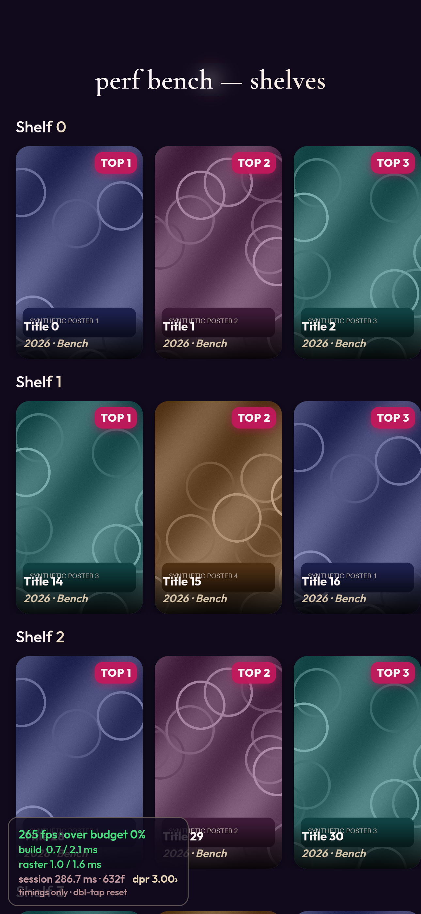
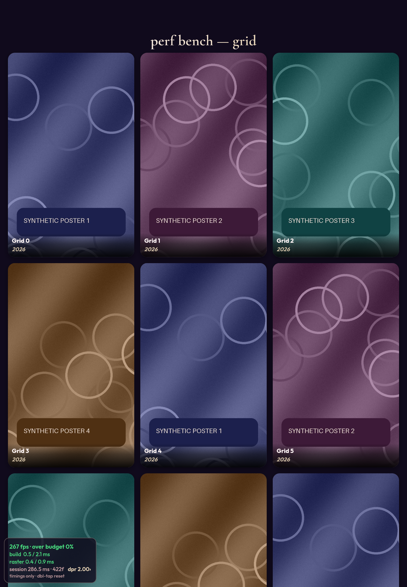

# PR proof — performance tooling and runtime cleanup

Public proof captures taken from the compile-time-gated `/perf-bench` routes
using **synthetic abstract posters only** (generated texture and rings). No
personal photos, private couple data, or external stock photos are used.

## Captures

### 1. Phone viewport (430×932, DPR 3) — shelves scene

Rendered at phone dimensions with the restored and corrected meter overlay.
- `over budget 0%`: session share over a reference 16.7ms budget (timings only, not presentation drops).
- `build 0.7 / 2.1 ms`, `raster 1.0 / 1.6 ms`.
- `session 286.7 ms · 632f`: full-session worst frame span (including first load) and uncapped frame count since reset. This peak is retained rather than discarded when the 240-frame rolling window fills.
- Double-tap reset publishes immediately to `window.__everglowPerf` and clears session counters.
- Dragging allows positioning anywhere on screen without covering interactive elements.

### 2. Tablet viewport (820×1180, DPR 2) — grid scene

- Dense vertical poster grid rendering synthetic posters 1–4.
- DPR 2 render scale applied cleanly without blurring or canvas clipping.
- Zero exceptions in browser console.
