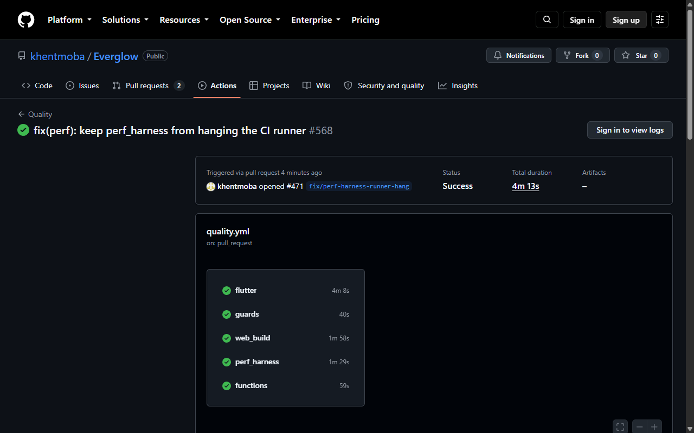

# perf_harness CI hardening — proof

No app change, no couple data. Proof is the CI run itself.

## What changed

- `tool/perf/_harness.mjs` — headless Chrome now launches with
  `--disable-dev-shm-usage` (GitHub Linux runners have tiny `/dev/shm`;
  SwiftShader software rendering exhausted it and OOM-killed the runner —
  PR #469 run 37306879221 hung 46 min this way).
- `.github/workflows/quality.yml` — `perf_harness` job capped at
  `timeout-minutes: 10` so a hung runner fails fast.

## Proof

Quality workflow on this branch, all green, `perf_harness` done in 1m29s
(run 37339192514):

## Checks run

- `node --test tool/perf/harness.test.mjs` — 18/18 pass (real Chrome controls).
- `node tool/service_worker_test.mjs --browser` — 14/14 pass (real Chrome offline control).
- Workflow YAML parses.
- All 7 PR checks green on this branch (flutter, guards, web_build,
  perf_harness, functions, preview, Deploy Preview).
